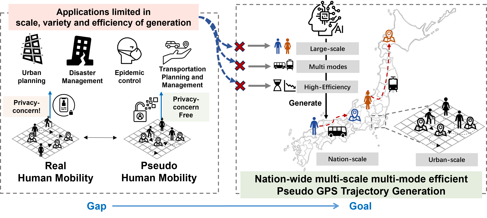

# TrajFlow: nationwide Pseudo GPS Trajectory Generation with Flow Matching Models

This repository is the  implementation of paper **TrajFlow: nationwide Pseudo GPS Trajectory Generation with Flow Matching Models**.



## Paper
TrajFlow is a flow-matching based framework for pseudo GPS trajectory generation targeting multi-scale mobility patterns.

- OpenReview page: https://openreview.net/forum?id=BDOldEjwCE
- PDF: https://openreview.net/pdf?id=BDOldEjwCE

## Data Availability
- This repository provides the training and inference pipeline for TrajFlow.
- The main paper conclusions are validated on **BW** data, which is commercial/private and not open-sourced here.
- We do **not** redistribute DiDi datasets due to policy restrictions. Please obtain data from official/authorized channels under your own compliance responsibility.
- A toy synthetic toy dataset is included only to demonstrate the expected processed data format and support smoke tests.

Expected local layout for testing:
 - `./data/toy_data`
- `./data/DiDiTaxi_Chengdu_traj`
- `./data/DiDiTaxi_XiAn_traj`

See `data/README.md` for the processed file schema.

## Setup
```bash
conda env create -f environment.yml
conda activate flow_matching_py311
pip install -r requirements.txt
```

Notes:
- `flow_matching` is installed as an external dependency via `requirements.txt`.
- This repository does not vendor a local `flow_matching/` copy.

## Usage

Toy-data smoke test:
```bash
python data/make_toy_data.py
python train.py --config ./src/config/config_toy.yaml
```

### YJMob100K Dataset1 engineering smoke

TIME-18 adds a bounded public-data adapter for the official
[YJMob100K v3 release](https://zenodo.org/records/10836269). Review its CC BY
4.0 terms and ethical-use restrictions before downloading it. The expected
Dataset1 checksum is `3781f6f03a118b5f639bdb4f94dcfdb8` (MD5).

```bash
mkdir -p data/raw/yjmob100k
curl -L \
  -o data/raw/yjmob100k/yjmob100k-dataset1.csv.gz \
  https://zenodo.org/api/records/10836269/files/yjmob100k-dataset1.csv.gz/content

python data_utils/prepare_yjmob.py \
  --input data/raw/yjmob100k/yjmob100k-dataset1.csv.gz \
  --output-dir data/processed/yjmob100k_d1_1k \
  --max-users 1000

# Physical cards 2 and 3 become visible logical cards 0 and 1.
CUDA_VISIBLE_DEVICES=2,3 python train.py \
  --config src/config/config_yjmob_smoke.yaml \
  --run-name yjmob1k-smoke

# Replace this value with the directory name printed by train.py.
RUN_NAME="yjmob1k-smoke_seed42_YYYYMMDD_HHMMSS_microseconds"
CUDA_VISIBLE_DEVICES=2,3 python generate.py \
  --config "outputs_yjmob_smoke/${RUN_NAME}/config.yaml" \
  --checkpoint "outputs_yjmob_smoke/models/${RUN_NAME}/best_model.pt" \
  --device cuda:0 \
  --generate_num 200 \
  --batch_size 32 \
  --exp_savename_str "${RUN_NAME}"
```

The converter excludes day 27, treats each user-day as one sample, resamples
the observed 30-minute slots to 120 points, and stores `uid`/`day` only in
`manifest.csv`. Train/validation/test membership is a deterministic SHA-256
hash of the user id, so one user cannot leak across splits. Continuous
condition statistics are fitted on the training split only.

`config_yjmob_smoke.yaml` runs only two epochs and is an engineering check, not
a reported baseline. It enables portable checkpoints, validation-based model
selection, deterministic seeds, two-visible-GPU `DataParallel`, and generation
metrics (density Jensen-Shannon divergence, paired exact DTW, and continuous
Fréchet distance). Generation writes these values to `baseline_metrics.json`.
Use a different `--seed` for an independent repeat.

The bounded convergence configuration keeps the same data representation,
model, objective, seed, and evaluation protocol. It raises only the training
horizon to 100 epochs, stops after 10 validation epochs without improvement,
and retains only `best_model.pt` plus `last_model.pt`. Expose only a confirmed
idle physical card from the approved set before launching it:

```bash
CUDA_VISIBLE_DEVICES=<2-or-3> python train.py \
  --config src/config/config_yjmob_convergence.yaml \
  --run-name yjmob1k-convergence
```

### Conditional coverage and longitudinal-habit diagnostics

Best-of-K generation reuses the frozen checkpoint and the same deterministic
test-condition selection. `--generate_num` is the number of unique conditions;
`--samples-per-condition` is the number of independent draws for each one:

```bash
CUDA_VISIBLE_DEVICES=<confirmed-idle-card> python generate.py \
  --config /path/to/frozen/config.yaml \
  --checkpoint /path/to/best_model.pt \
  --device cuda:0 \
  --generate_num 200 \
  --samples-per-condition 20 \
  --metric-workers 8 \
  --batch_size 8 \
  --exp_savename_str yjmob1k-best-of-20
```

For K greater than one, generation writes `best_of_k_metrics.json` and a
compressed candidate array instead of expanding the same arrays into the legacy
row-wise trajectory CSVs. The report contains the minimum paired exact DTW
and continuous Fréchet distance across K, all-pair aligned-point diversity, a
deterministic O-to-D line control, and separate point/trajectory OOB rates.
Best-of-K is an oracle coverage diagnostic: increasing K can improve it by
construction, so it is not a training or model-selection gate.

The raw-data habit profiler uses the exact user cohort retained in a prepared
manifest and never uses the 120-point interpolation:

```bash
python data_utils/analyze_yjmob_habits.py \
  --input data/raw/yjmob100k/yjmob100k-dataset1.csv.gz \
  --manifest data/processed/yjmob100k_d1_1k/manifest.csv \
  --output-dir outputs_yjmob_habits/seed42-1k \
  --null-repeats 20 \
  --seed 42
```

It reports raw-slot coverage and internal gaps, per-user/per-timeslot modal-cell
rates, chronological holdout accuracy against a population-timeslot control,
lagged cross-day similarity, and a null that shuffles locations only among each
user-day's observed timeslots. The official data descriptor defines `d` as a
masked date and does not publish its civil-date mapping. Consequently, the
profiler reports all seven `d % 7` offsets and an explicitly inferred
"weekend-like" low-activity phase pair; it never assigns civil weekday names or
attempts to reverse-engineer the hidden calendar.

Training:
```bash
python train.py --config ./src/config/config_chengdu.yaml
# XiAn:
# python train.py --config ./src/config/config_xian.yaml
```

Generation:
```bash
python generate.py \
  --config ./outputs/run_YYYYMMDD_HHMMSS/config.yaml \
  --checkpoint ./outputs/models/run_YYYYMMDD_HHMMSS/best_model.pt
```

## License
Unless otherwise noted, the original code in this repository is released under **CC BY-NC 4.0** (`LICENSE`).

This repository also includes third-party code under separate licenses. For example, `src/utils/jismesh_v2/` is distributed under the **MIT License**; see `src/utils/jismesh_v2/LICENSE`.

## Citation
If you use this repository, please cite:

```bibtex
@inproceedings{li2026trajflow,
  title={TrajFlow: nationwide Pseudo GPS Trajectory Generation with Flow Matching Models},
  author={Li, Peiran and Wang, Jiawei and Zhang, Haoran and Shi, Xiaodan and Koshizuka, Noboru and Shimizu, Chihiro and Jiang, Renhe},
  booktitle={International Conference on Learning Representations (ICLR)},
  year={2026},
  url={https://openreview.net/forum?id=BDOldEjwCE}
}
```
